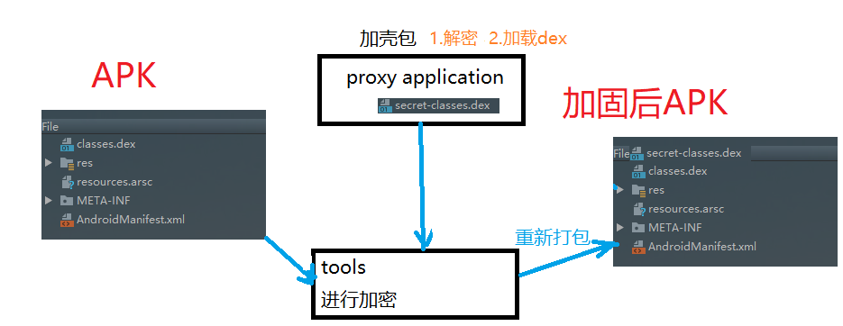

# 前言

apk正常打包后可以通过 [反编译工具使用](<https://www.jianshu.com/p/b441ae7c41f2>) 得到源码，那这么长时间的辛苦不就白费了吗，这就引出一个问题了：怎么保证不让别人不容易拿到源码呢？

当然得是通过加固啦，使用第三方的加固工具 (结尾给大家)，但是作为一名热爱学习的程序员，当然得明白其中的原理才好。

# app加固原理



1. 制作一个壳程序  (功能：解密和加载dex文件)
2. 使用加密工具对原apk的dex文件进行加密
3. 最后重新打包、对齐、签名

# 实现

## 1. 制作壳程序

- 制作壳程序，壳程序包含两功能解密dex文件和加载dex文件，先说加载dex，

- 解密dex文件：解压apk包得到dex文件，然后把加密过的dex文件进行解密

- 那系统又是怎么加载dex文件呢？

  源码位置：Android源码目录\libcore\dalvik\src\main\java\dalvik\system\DexClassLoader.java

  ```
  public class DexClassLoader extends BaseDexClassLoader {
      public DexClassLoader(String dexPath, String optimizedDirectory,
              String librarySearchPath, ClassLoader parent) {
          super(dexPath, new File(optimizedDirectory), librarySearchPath, parent);
      }
  }
  ```

  这里调用父类的构造方法

  源码位置：Android源码目录\libcore\dalvik\src\main\java\dalvik\system\BaseDexClassLoader.java

  看下面这个方法

  ```
  @Override
  protected Class<?> findClass(String name) throws ClassNotFoundException {
          List<Throwable> suppressedExceptions = new ArrayList<Throwable>();
          //这里传个名字 和 集合， 就是说把某个类进行加载 
          Class c = pathList.findClass(name, suppressedExceptions);
          if (c == null) {
              ClassNotFoundException cnfe = new ClassNotFoundException(
                      "Didn't find class \"" + name + "\" on path: " + pathList);
              for (Throwable t : suppressedExceptions) {
                  cnfe.addSuppressed(t);
              }
              throw cnfe;
          }
          return c;
  }
  ```

  源码位置：Android源码目录\libcore\dalvik\src\main\java\dalvik\system\DexPathList.java

  ```
  public Class findClass(String name, List<Throwable> suppressed) {
         //通过遍历dexElements去加载
         for (Element element : dexElements) {
              DexFile dex = element.dexFile;
  
              if (dex != null) {
                  Class clazz = dex.loadClassBinaryName(name, definingContext, suppressed);
                  if (clazz != null) {
                      return clazz;
                  }
              }
          }
          if (dexElementsSuppressedExceptions != null) {
              suppressed.addAll(Arrays.asList(dexElementsSuppressedExceptions));
        }
          return null;
  }
  ```

  从这个方法中看到，dex是通过遍历dexElements去加载的，可以通过反射dexElements拿到已经加载的dex文件，那我们看dexElements的初始化

  ```
    //dexElements 初始化
  this.dexElements = makePathElements(splitDexPath(dexPath), optimizedDirectory,
                                              suppressedExceptions);
  
  
   private static Element[] makePathElements(List<File> files, File optimizedDirectory,
                                                List<IOException> suppressedExceptions) {
  ............................                                              
  }
  ```

  那我们通过反射调用这个方法把解密后的dex文件通过makePathElements方法反射 加载进来，再和原来的dex合并，那这个app就能运行了。

## 2. 加密工具

- 对已经打包好的apk进行解压
- 使用AES算法对解压后里面的dex文件进行加密

## 3. 重新打包、对齐、签名

1. 重新打包

   把壳程序的dex文件和加密后的文件进行打包

2. 对齐

   ```
   zipalign -v -p 4 input_unsigned.apk output_unsigned.apk
   ```

3. 签名

   ```
   apksigner sign  --ks jks文件地址 --ks-key-alias 别名 --ks-pass pass:jsk密码 --key-pass pass:别名密码 --out  out.apk in.apk
   ```
